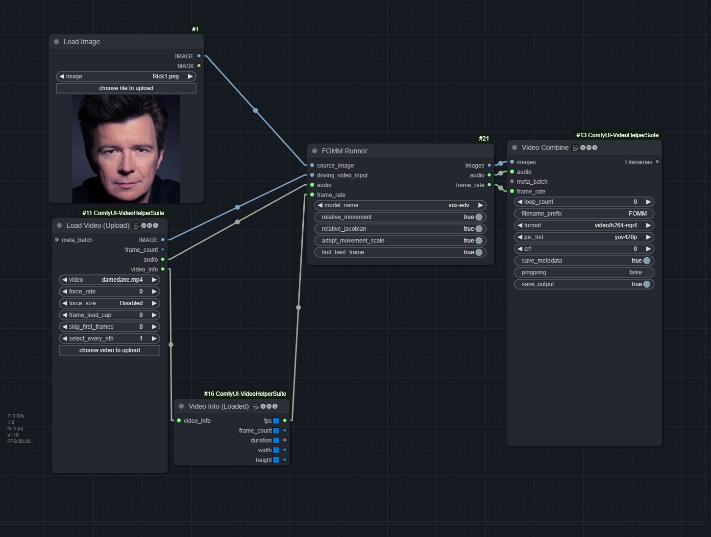

# ComfyUI-FirstOrderMM
A ComfyUI-native node to run First Order Motion Model for Image Animation

https://github.com/AliaksandrSiarohin/first-order-model

## Workflow:

[FOMM.json](FOMM.json)



## Arguments
* `relative_movement`: Relative keypoint displacement (Inherit object proporions from the video)
* `relative_jacobian`: No idea what this does, but usually == `relative_movement`
* `adapt_movement_scale`: If disabled, will heavily distort the source face to match the driving face
* `find_best_frame`: Find driving frame that best match the source. Split the batch into two halves, with the first half reversed. Gives mixed results. Needs to install `face-alignment` library.

## Installation

1. Clone the repo to `ComfyUI/custom_nodes/`
```
git clone https://github.com/FuouM/ComfyUI-FirstOrderMM.git
```

2. Install required dependencies
```
pip install -r requirements.txt
```

**Optional**: Install [face-alignment](https://github.com/1adrianb/face-alignment) to use the `find_best_frame` feature:

```
pip install face-alignment
```

## Model 

Currently supporting `vox` and `vox-adv`. Models can and must be manually downloaded from:
* [AliaksandrSiarohin/first-order-model](https://github.com/AliaksandrSiarohin/first-order-model)
* [graphemecluster/first-order-model-demo](https://github.com/graphemecluster/first-order-model-demo)

Place them in the `checkpoints` folder. It should look like this:
```
place_checkpoints_here.txt
vox-adv-cpk.pth.tar
vox-cpk.pth.tar
```