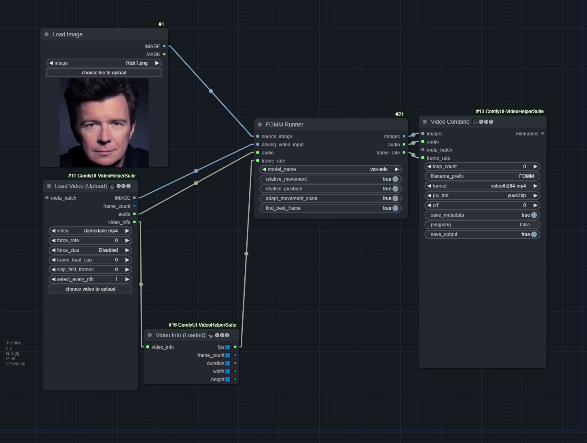
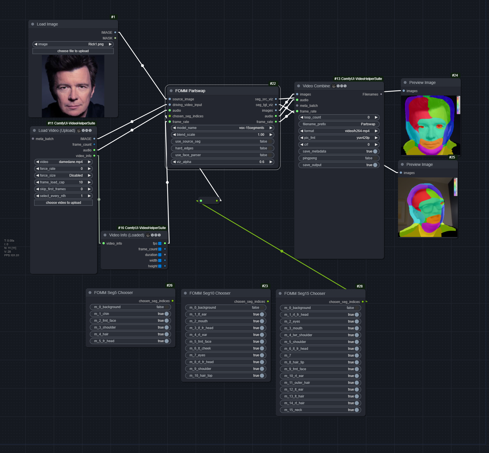
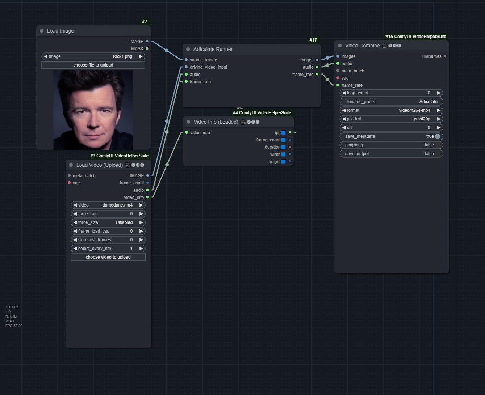
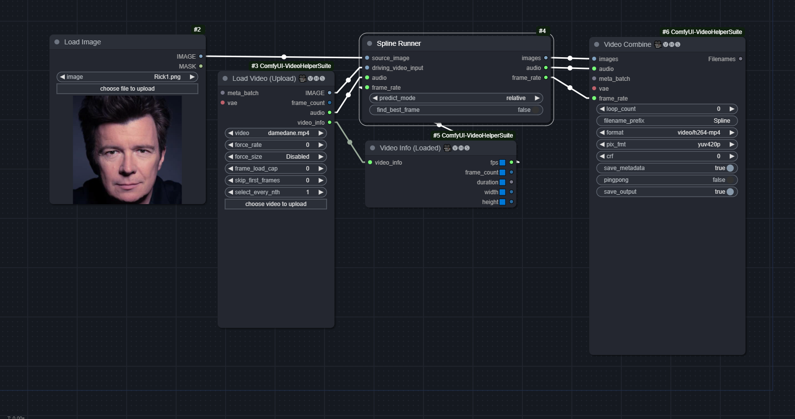

# ComfyUI-FirstOrderMM
A ComfyUI-native node to run First Order Motion Model for Image Animation

https://github.com/AliaksandrSiarohin/first-order-model

Now supports:
1. Face Swapping using [Motion Supervised co-part Segmentation](https://github.com/AliaksandrSiarohin/motion-cosegmentation): 
2. [Motion Representations for Articulated Animation](https://github.com/snap-research/articulated-animation)
3. [Thin-Plate Spline Motion Model for Image Animation](https://github.com/yoyo-nb/thin-plate-spline-motion-model)

https://github.com/user-attachments/assets/b2948efb-3b44-440b-bff2-dde7b95a9946

## Workflow:

### FOMM

[FOMM.json](workflows/FOMM.json)



### Part Swap

[FOMM_PARTSWAP.json](workflows/FOMM_PARTSWAP.json)



### Articulate

[ARTICULATE.json](workflows/ARTICULATE.json)




### Spline

[SPLINE.json](workflows/SPLINE.json)




## Arguments

### FOMM

* `relative_movement`: Relative keypoint displacement (Inherit object proporions from the video)
* `relative_jacobian`: Only taken into effect when `relative_movement` is on, must also be on to avoid heavy deformation of the face (in a freaky way)
* `adapt_movement_scale`: If disabled, will heavily distort the source face to match the driving face
* `find_best_frame`: Find driving frame that best match the source. Split the batch into two halves, with the first half reversed. Gives mixed results. Needs to install `face-alignment` library.

### Part Swap

* `blend_scale`: No idea, keeping at default = 1.0 seems to be fine
* `use_source_seg`: Whether to use the source's segmentation or the target's. May help if some of the target's segmentation regions are missing
* `hard_edges`: Whether to make the edges hard, instead of feathering
* `use_face_parser`: For Seg-based models, may help with cleaning up residual background (should only use `15seg` with this). TODO: Additional cleanup face_parser masks. Should definitely be used for FOMM models
* `viz_alpha`: Opacity of the segments in the visualization

### Articulate

Doesn't need any

### Spline

* `predict_mode`: Can be
  * `relative`: Similar to FOMM's `relative_movement` and `adapt_movement_scale` set to True
  * `standard`: Similar to FOMM's `adapt_movement_scale` set to False
  * `avd`: similar to `relative`, may yield better but more "jittery/jumpy" result
* `find_best_frame`: Same as FOMM

## Installation

1. Clone the repo to `ComfyUI/custom_nodes/`
```
git clone https://github.com/FuouM/ComfyUI-FirstOrderMM.git
```

2. Install required dependencies
```
pip install -r requirements.txt
```

**Optional**: Install [face-alignment](https://github.com/1adrianb/face-alignment) to use the `find_best_frame` feature:

```
pip install face-alignment
```

## Model 

FOMM currently supporting `vox` and `vox-adv`. Models can and must be manually downloaded from:
* [AliaksandrSiarohin/first-order-model](https://github.com/AliaksandrSiarohin/first-order-model)
* [graphemecluster/first-order-model-demo](https://github.com/graphemecluster/first-order-model-demo)

Part Swap currently supporting Seg-based models and FOMM (`vox` and `vox-adv`) models.
* `vox-5segments`
* `vox-10segments`
* `vox-15segments`
* `vox-first-order (partswap)` 

These models can be found in the original repository [Motion Supervised co-part Segmentation](https://github.com/AliaksandrSiarohin/motion-cosegmentation) 

Place them in the `checkpoints` folder. It should look like this:
```
place_checkpoints_here.txt
vox-adv-cpk.pth.tar
vox-cpk.pth.tar

vox-5segments.pth.tar
vox-10segments.pth.tar
vox-15segments.pth.tar
vox-first-order.pth.tar
```

For Part Swap, Face-Parsing is also supported **(Optional)** (especially when using the FOMM or `vox-first-order` models)

* resnet18 `resnet18-5c106cde`: https://download.pytorch.org/models/resnet18-5c106cde.pth
* face_parsing `79999_iter.pth`: https://github.com/zllrunning/face-makeup.PyTorch/tree/master/cp

Place them in `face_parsing` folder:
```
face_parsing_model.py
...
resnet18-5c106cde.pth
79999_iter.pth
```

For **Articulate**, download the model from [Pre-trained checkpoints](https://github.com/snap-research/articulated-animation?tab=readme-ov-file#pre-trained-checkpoints) section and place it here: `articulate_module/models/vox256.pth`

For **Spline**, download the model from [Pre-trained models](https://github.com/yoyo-nb/thin-plate-spline-motion-model?tab=readme-ov-file#pre-trained-models) section and place it here: `spline_module/models/vox.pth.tar`. To use `find_best_frame`, install `face-alignment`.
