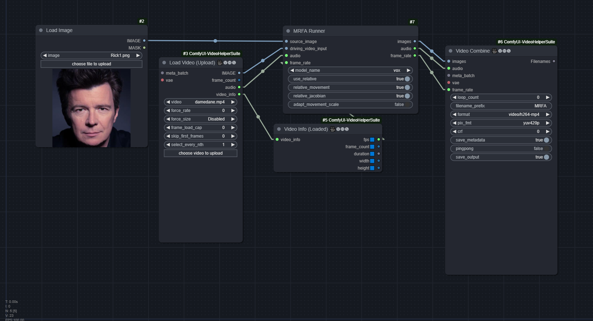
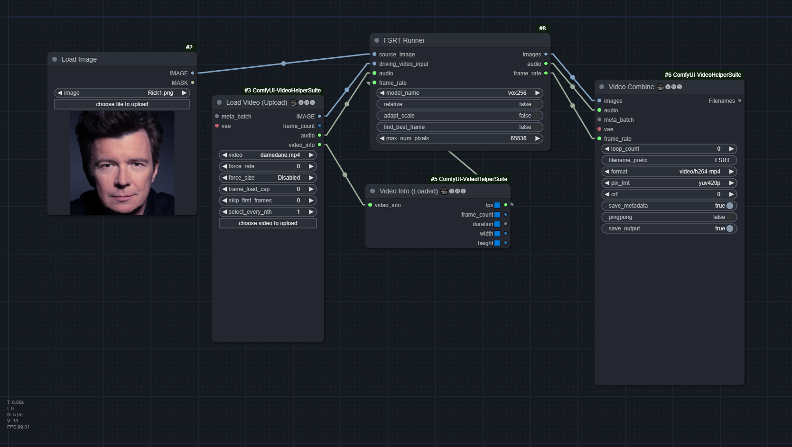

# ComfyUI-FirstOrderMM
ComfyUI-native nodes to run First Order Motion Model for Image Animation and its non-diffusion-based successors.

https://github.com/AliaksandrSiarohin/first-order-model

Now supports:
1. Face Swapping using [Motion Supervised co-part Segmentation](https://github.com/AliaksandrSiarohin/motion-cosegmentation): 
2. [Motion Representations for Articulated Animation](https://github.com/snap-research/articulated-animation)
3. [Thin-Plate Spline Motion Model for Image Animation](https://github.com/yoyo-nb/thin-plate-spline-motion-model)
4. [Learning Motion Refinement for Unsupervised Face Animation](https://github.com/JialeTao/MRFA/)
5. [Facial Scene Representation Transformer for Face Reenactment](https://github.com/andrerochow/fsrt)

https://github.com/user-attachments/assets/b090061d-8f12-42c4-b046-d8b0e0a69685

## Workflow:

### FOMM

[FOMM.json](workflows/FOMM.json)


### Part Swap

[FOMM_PARTSWAP.json](workflows/FOMM_PARTSWAP.json)


### Articulate

[ARTICULATE.json](workflows/ARTICULATE.json)


### Spline

[SPLINE.json](workflows/SPLINE.json)


### MRFA

[MRFA.json](workflows/MRFA.json)



### FSRT

[FSRT.json](workflows/FSRT.json)



## Arguments

### FOMM

* `relative_movement`: Relative keypoint displacement (Inherit object proporions from the video)
* `relative_jacobian`: Only taken into effect when `relative_movement` is on, must also be on to avoid heavy deformation of the face (in a freaky way)
* `adapt_movement_scale`: If disabled, will heavily distort the source face to match the driving face
* `find_best_frame`: Find driving frame that best match the source. Split the batch into two halves, with the first half reversed. Gives mixed results. Needs to install `face-alignment` library.

### Part Swap

* `blend_scale`: No idea, keeping at default = 1.0 seems to be fine
* `use_source_seg`: Whether to use the source's segmentation or the target's. May help if some of the target's segmentation regions are missing
* `hard_edges`: Whether to make the edges hard, instead of feathering
* `use_face_parser`: For Seg-based models, may help with cleaning up residual background (should only use `15seg` with this). TODO: Additional cleanup face_parser masks. Should definitely be used for FOMM models
* `viz_alpha`: Opacity of the segments in the visualization

### Articulate

Doesn't need any

### Spline

* `predict_mode`: Can be
  * `relative`: Similar to FOMM's `relative_movement` and `adapt_movement_scale` set to True
  * `standard`: Similar to FOMM's `adapt_movement_scale` set to False
  * `avd`: similar to `relative`, may yield better but more "jittery/jumpy" result
* `find_best_frame`: Same as FOMM


### MRFA

* `model_name`: `vox` or `celebvhq`, which is trained on (presumably) the `vox256` and `celebhq` datasets respectively.
* `use_relative`: Whether to use relative mode or not (absolute mode). Absolute mode is similar to FOMM's `adapt_movement_scale` set to False
* `relative_movement`, `relative_jacobian`, `adapt_movement_scale`: Same as FOMM

### FSRT

This model takes the longest to run. The full Damedane example takes ~6 minutes

* `model_name`: `vox256` or `vox256_2Source`, which is trained on (presumably) the `vox256` and `vox256+celebhq` datasets respectively.
* `use_relative`: Use relative or absolute keypoint coordinates
* `adapt_scale`: Adapt movement scale based on convex hull of keypoints
* `find_best_frame`: Same as FOMM
* `max_num_pixels`: Number of parallel processed pixels. Reduce this value if you run out of GPU memory


## Installation

1. Clone the repo to `ComfyUI/custom_nodes/`
```
git clone https://github.com/FuouM/ComfyUI-FirstOrderMM.git
```

2. Install required dependencies
```
pip install -r requirements.txt
```

**Optional**: Install [face-alignment](https://github.com/1adrianb/face-alignment) to use the `find_best_frame` feature:

```
pip install face-alignment
```

## Models

### FOMM and Part Swap

**FOMM**: `vox` and `vox-adv` from
* [AliaksandrSiarohin/first-order-model](https://github.com/AliaksandrSiarohin/first-order-model)
* [graphemecluster/first-order-model-demo](https://github.com/graphemecluster/first-order-model-demo)

**Part Swap**

* `vox-5segments`
* `vox-10segments`
* `vox-15segments`
* `vox-first-order (partswap)` 

These models can be found in the original repository [Motion Supervised co-part Segmentation](https://github.com/AliaksandrSiarohin/motion-cosegmentation) 

Place them in the `checkpoints` folder. It should look like this:
```
place_checkpoints_here.txt
vox-adv-cpk.pth.tar
vox-cpk.pth.tar

vox-5segments.pth.tar
vox-10segments.pth.tar
vox-15segments.pth.tar
vox-first-order.pth.tar
```

For Part Swap, Face-Parsing is also supported **(Optional)** (especially when using the FOMM or `vox-first-order` models)

* resnet18 `resnet18-5c106cde`: https://download.pytorch.org/models/resnet18-5c106cde.pth
* face_parsing `79999_iter.pth`: https://github.com/zllrunning/face-makeup.PyTorch/tree/master/cp

Place them in `face_parsing` folder:
```
face_parsing_model.py
...
resnet18-5c106cde.pth
79999_iter.pth
```

### Other

| Model Arch | File Path | Source |
|------------|-----------|--------|
| **Articulate** | `module_articulate/models/vox256.pth` | [Articulated Animation (Pre-trained checkpoints)](https://github.com/snap-research/articulated-animation?tab=readme-ov-file#pre-trained-checkpoints) |
| **Spline** | `module_articulate/models/vox.pth.tar` | [Thin Plate Spline Motion Model (Pre-trained models)](https://github.com/yoyo-nb/thin-plate-spline-motion-model?tab=readme-ov-file#pre-trained-models) |
| **MRFA** (celebvhq) | `module_mrfa/models/celebvhq.pth` | [MRFA (Pre-trained checkpoints)](https://github.com/JialeTao/MRFA/?tab=readme-ov-file#pretrained-models) |
| **MRFA** (vox) | `module_mrfa/models/vox.pth` | [MRFA (Pre-trained checkpoints)](https://github.com/JialeTao/MRFA/?tab=readme-ov-file#pretrained-models) |
| **FSRT** (kp_detector) | `module_fsrt/models/kp_detector.pt` | [FSRT (Pretrained Checkpoints)](https://github.com/andrerochow/fsrt?tab=readme-ov-file#pretrained-checkpoints) |
| **FSRT** (vox256) | `module_fsrt/models/vox256.pt` | [FSRT (Pretrained Checkpoints)](https://github.com/andrerochow/fsrt?tab=readme-ov-file#pretrained-checkpoints) |
| **FSRT** (vox256_2Source) | `module_fsrt/models/vox256_2Source.pt` | [FSRT (Pretrained Checkpoints)](https://github.com/andrerochow/fsrt?tab=readme-ov-file#pretrained-checkpoints) |

Notes:
- For **Spline** and **FSRT**, to use `find_best_frame`, follow above instructions to install `face-alignment` with its models.
- For **FSRT**, you must download `kp_detector`

## Credits

```
@InProceedings{Siarohin_2019_NeurIPS,
  author={Siarohin, Aliaksandr and Lathuilière, Stéphane and Tulyakov, Sergey and Ricci, Elisa and Sebe, Nicu},
  title={First Order Motion Model for Image Animation},
  booktitle = {Conference on Neural Information Processing Systems (NeurIPS)},
  month = {December},
  year = {2019}
}
```

```
@InProceedings{Siarohin_2019_NeurIPS,
  author={Siarohin, Aliaksandr and Lathuilière, Stéphane and Tulyakov, Sergey and Ricci, Elisa and Sebe, Nicu},
  title={First Order Motion Model for Image Animation},
  booktitle = {Conference on Neural Information Processing Systems (NeurIPS)},
  month = {December},
  year = {2019}
}
```

```
@inproceedings{siarohin2021motion,
        author={Siarohin, Aliaksandr and Woodford, Oliver and Ren, Jian and Chai, Menglei and Tulyakov, Sergey},
        title={Motion Representations for Articulated Animation},
        booktitle = {CVPR},
        year = {2021}
}
```

```
@inproceedings{
tao2023learning,
title={Learning Motion Refinement for Unsupervised Face Animation},
author={Jiale Tao and Shuhang Gu and Wen Li and Lixin Duan},
booktitle={Thirty-seventh Conference on Neural Information Processing Systems},
year={2023},
url={https://openreview.net/forum?id=m9uHv1Pxq7}
}
```

```
@inproceedings{rochow2024fsrt,
  title={{FSRT}: Facial Scene Representation Transformer for Face Reenactment from Factorized Appearance, Head-pose, and Facial Expression Features},
  author={Rochow, Andre and Schwarz, Max and Behnke, Sven},
  booktitle={IEEE/CVF Conference on Computer Vision and Pattern Recognition (CVPR)},
  year={2024}
}
```
